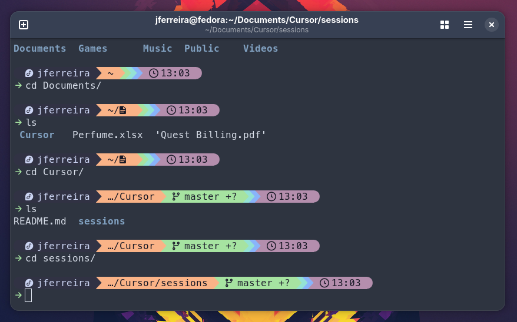

# Starship with Catppuccin theme


[](https://github.com/sponsors/johnycsf)
[](LICENSE)
[](../../issues/new/choose)

My [Starship](https://starship.rs/) prompt config (Catppuccin Mocha).

**Starship + Catppuccin Mocha** — one-liner install for bash/zsh.

Works with **bash** and **zsh**.



## Support this work

If this stack saved you setup time, please consider sponsoring — it funds:

- Keeping install/update/backup scripts working across common Linux distros
- Testing safe upgrades against **official** upstream images
- Building more beginner-friendly stacks that share the same `./manage.sh` UX

[](https://github.com/sponsors/johnycsf)

👉 **[github.com/sponsors/johnycsf](https://github.com/sponsors/johnycsf)**

## Quick install

Use a **non-Mono** Nerd Font in your terminal (e.g. `MesloLGS Nerd Font`) so OS icons are full size, then run:

```bash
curl -fsSL https://raw.githubusercontent.com/johnycsf/Starship-Catppuccin-Dotfiles/main/install.sh | bash
```

That installs Starship if needed, drops in this config, and wires up bash and/or zsh.

Or clone and run locally:

```bash
git clone https://github.com/johnycsf/Starship-Catppuccin-Dotfiles.git
cd Starship-Catppuccin-Dotfiles
./install.sh        # bash and/or zsh
./install.sh bash   # bash only
./install.sh zsh    # zsh only
```

Open a new terminal (or `source ~/.bashrc` / `source ~/.zshrc`).

## Manual install

1. Install Starship: https://starship.rs/guide/#%F0%9F%9A%80-installation
2. Copy the config:

```bash
mkdir -p ~/.config
curl -fsSL https://raw.githubusercontent.com/johnycsf/Starship-Catppuccin-Dotfiles/main/starship.toml \
  -o ~/.config/starship.toml
```

3. Add **one** of these to your shell rc:

**bash** (`~/.bashrc`):

```bash
eval "$(starship init bash)"
```

**zsh** (`~/.zshrc`):

```zsh
eval "$(starship init zsh)"
```

## Credits

This repo packages or configures upstream software. See [CREDITS.md](CREDITS.md) for the main developers and projects this work builds on.

## Disclaimer

This project is provided **as is**. The author is **not responsible** for any loss, damage, data corruption, downtime, security issues, or other consequences from using it. Full text: [DISCLAIMER.md](DISCLAIMER.md).

## Bug reports & contributions

If you hit an error, please [open a GitHub Issue](../../issues/new/choose) and follow [CONTRIBUTING.md](CONTRIBUTING.md). Fixes via Pull Request are welcome. GitHub Issues/PRs are the supported way to report problems—there is no private support channel.

## Security

See [SECURITY.md](SECURITY.md) for how to report vulnerabilities.
